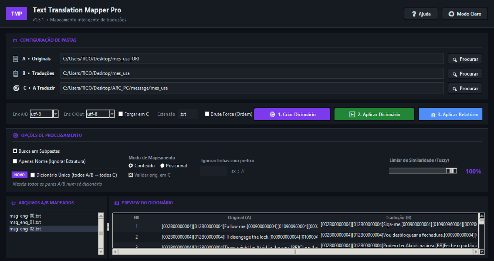

# 🗺️ Text Translation Mapper Pro  

**Text Translation Mapper Pro** é uma aplicação gráfica em Python criada para facilitar  
traduções técnicase localizações de jogos, mods e projetos de texto em larga escala.  

Ela funciona criando **dicionários de tradução por conteúdo**, comparando arquivos originais (A) e traduzidos (B),  
e aplicando automaticamente essas traduções em um terceiro conjunto de arquivos (C), mesmo que a ordem das linhas seja diferente.  

---  

## ✨ Principais Recursos    

✔ Interface gráfica (Tkinter)    
✔ Tradução baseada no **conteúdo da linha**, não na posição    
✔ Dicionário independente para cada arquivo    
✔ Suporte a **subpastas**    
✔ Aplicação em lote com relatório detalhado   
✔ Preview visual dos mapeamentos  
✔ Modo escuro 🌙  

---

## 🔤 Detecção Inteligente de Encoding (Versão 1.5+)  

A leitura dos arquivos utiliza um sistema robusto de detecção automática:  

1. **BOM (Byte Order Mark)** — prioridade máxima   
2. **chardet** — detecção estatística com nível de confiança  
3. **Fallback manual** — encoding selecionado pelo usuário  

Tudo isso é registrado em logs detalhados para total transparência.

Suporta, entre outros:
- UTF-8
- UTF-16 (LE / BE)
- CP1252
- Latin-1

---

## 🧠 Como Funciona

### 📁 Pastas
- **Pasta A** → Arquivos originais
- **Pasta B** → Arquivos traduzidos
- **Pasta C** → Arquivos que receberão a tradução

### 🔄 Processo
1. A ferramenta compara A ↔ B e cria um dicionário por arquivo
2. Cada linha original vira uma chave
3. A tradução correspondente vira o valor
4. Em C, cada linha é substituída se existir no dicionário

---

## 🚀 Como Usar

1. Execute o script Python
2. Selecione as pastas **A**, **B** e **C**
3. Defina a extensão dos arquivos (`.txt`, `.lua`, etc.)
4. Clique em **1. Construir Mapeamentos**
5. Clique em **2. Aplicar em C + Relatório**

Ao final:
- Os arquivos traduzidos são salvos em uma pasta `_TRA`
- Um relatório `.txt` é gerado com linhas não traduzidas

---

## 🖥️ Interface

- Lista de arquivos comuns encontrados
- Preview do dicionário do arquivo selecionado
- Barra de progresso
- Logs detalhados em tempo real
---

## 📦 Requisitos

- Python 3.9+
- Dependências:

  pip install chardet
